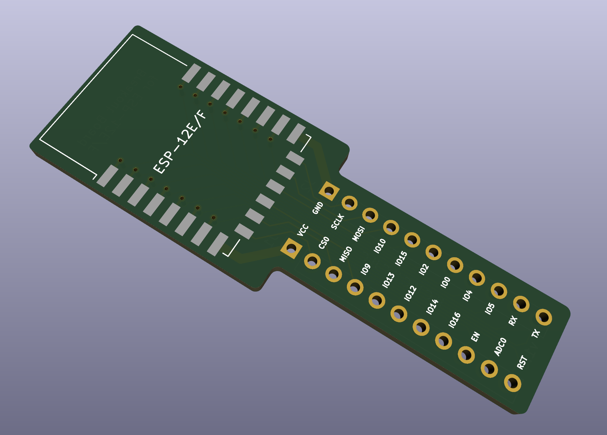
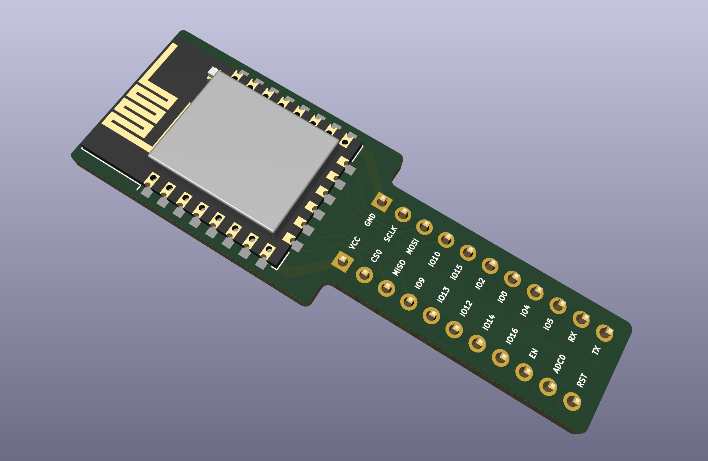
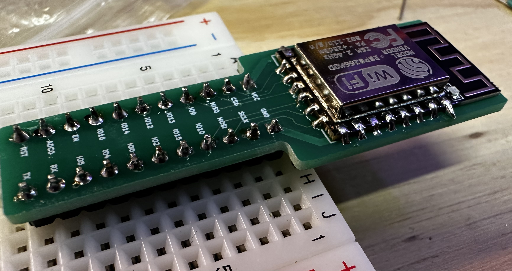
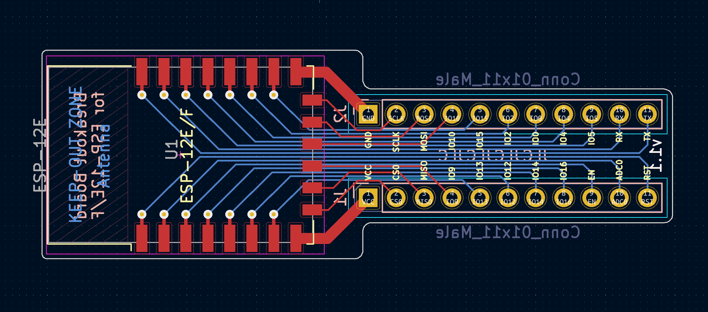

# Breakout Board for ESP-12E and ESP-12F

This repo contains all the design files to make a breakout board for the ESP-12E and the ESP-12F which will allow you to use the ESP module on a breadboard.

The project was created using KiCAD v6.

## Design Goals

1. Breadboard compatible (i.e. 2.54mm pitch)
1. Breadboard connection doesn't cover all the breadboard holes
1. Max 2-sided PCB
1. As small (read: cheap to fabricate) as possible

## Screenshots/Photos

## License

This repo is licensed under the [Attribution-ShareAlike 4.0 license (CC BY-SA 4.0)](https://creativecommons.org/licenses/by-sa/4.0/)
